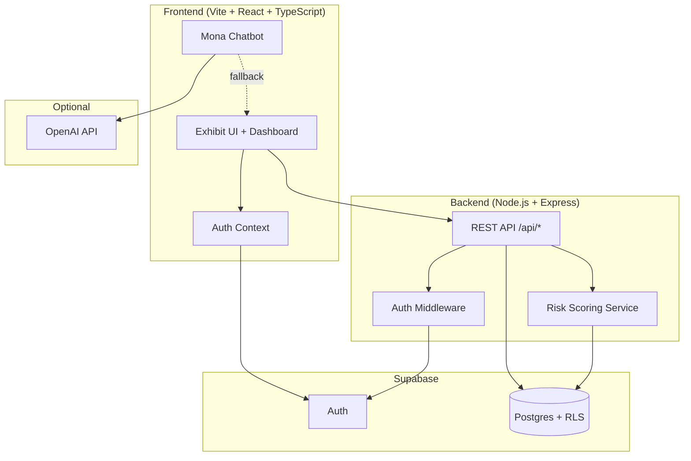

# Monami — State Farm WeHack 2026

**A mobile-first home insurance education platform with an AI tour guide.**

Monami helps homeowners understand risk scores, compare policy tiers, and navigate renewal decisions through an interactive exhibit-style experience. Users complete a home survey, receive a personalized risk score, explore policy education modules, and chat with **Mona** — an AI assistant that explains insurance concepts in plain language.

> **For recruiters:** Full-stack TypeScript/React app with Express API, Supabase auth + Postgres, rule-based risk scoring, and OpenAI-powered chat with graceful offline fallback. This repo is our **State Farm WeHack 2026 hackathon submission**. A polished portfolio copy lives at [github.com/pranathigadhanki-alt/monami](https://github.com/pranathigadhanki-alt/monami).

---

## Features

- **Guided exhibit flow** — Four interactive modules covering survey, policy education, recommendations, and dashboard
- **Personalized risk scoring** — Backend algorithm weighs home age, location, value, and safety features (0–10 scale)
- **Policy comparison** — Basic vs. Premium tier education with renewal guidance
- **Mona AI chatbot** — OpenAI-powered assistant with local fallback when API is unavailable
- **Supabase auth** — Secure login, row-level security, and user-scoped data
- **Mobile-first UI** — React + Tailwind CSS + Radix/shadcn components, designed from Figma

---

## Architecture



---

## Tech Stack

| Layer | Technologies |
|-------|-------------|
| Frontend | React 18, TypeScript, Vite 6, Tailwind CSS 4, Radix UI, React Router 7 |
| Backend | Node.js, Express 5, ES modules |
| Database | Supabase (Postgres, Auth, Row-Level Security) |
| AI | OpenAI GPT (optional), local keyword fallback |
| Tooling | npm, dotenv |

---

## Project Structure

```
Monami_StateFarm_WeHack_FINAL/
├── src/
│   ├── app/              # Pages, layouts, shadcn UI, auth context
│   ├── lib/              # API client, Supabase, Mona chatbot
│   └── styles/           # Tailwind + theme
├── backend/
│   ├── src/              # Express controllers, services, routes
│   └── supabase/         # DB schema + RLS policies
├── scripts/
│   └── seed-demo-user.mjs
├── package.json
└── vite.config.ts
```

---

## Quick Start

### Prerequisites

- Node.js 18+
- npm
- A [Supabase](https://supabase.com) project (free tier works)

### 1. Clone & install

```bash
git clone https://github.com/pranathigadhanki-alt/Monami_StateFarm_WeHack_FINAL.git
cd Monami_StateFarm_WeHack_FINAL
npm install
```

### 2. Configure environment

```bash
cp .env.example .env
cp backend/.env.example backend/.env
```

Fill in your Supabase URL and anon key in both files. OpenAI key is optional — Mona falls back to local responses without it.

### 3. Set up the database

Open the Supabase SQL Editor and run the full contents of `backend/supabase/schema.sql`.

### 4. Run locally

Terminal 1 — backend:

```bash
npm run dev:backend
```

Terminal 2 — frontend:

```bash
npm run dev
```

Open `http://localhost:5173` (or the port Vite prints).

### 5. Demo account (optional)

```bash
npm run seed:demo-user
```

| Field | Value |
|-------|-------|
| Email | `monaLisa@gmail.com` |
| Password | `monami` |

---

## API Reference

Base URL: `http://localhost:4000`

| Method | Endpoint | Description |
|--------|----------|-------------|
| `GET` | `/health` | Health check (no auth) |
| `GET` | `/api/user-profile/me` | Current user profile |
| `POST` | `/api/survey/me` | Submit home survey |
| `GET` | `/api/survey/me/latest` | Latest survey response |
| `POST` | `/api/risk-scores/recalculate` | Recalculate risk score |
| `GET` | `/api/risk-scores/me/latest` | Latest risk score |
| `GET` | `/api/policies/me` | User policy |
| `GET` | `/api/renewal-suggestions/me` | Renewal recommendations |
| `GET` | `/api/progress/me` | Exhibit progress |
| `PUT` | `/api/progress/me` | Update exhibit progress |

All `/api/*` routes require a Supabase bearer token.

---

## Scripts

| Command | Description |
|---------|-------------|
| `npm run dev` | Start Vite dev server |
| `npm run dev:backend` | Start Express API with hot reload |
| `npm run build` | Production frontend build |
| `npm run start:backend` | Start backend (production) |
| `npm run seed:demo-user` | Seed demo account + sample data |

---

## Hackathon Context

Built for **State Farm WeHack 2026** — an insurance education prototype demonstrating how technology can make home insurance concepts accessible to first-time homeowners through guided learning and conversational AI.

---

## Team

| Name | GitHub |
|------|--------|
| Pranathi Gadhanki | [@pranathigadhanki-alt](https://github.com/pranathigadhanki-alt) |
| Akshitha Jakka | [@Sharc07](https://github.com/Sharc07) |
| vedaSarayu | [@vedaSarayu](https://github.com/vedaSarayu) |

---
